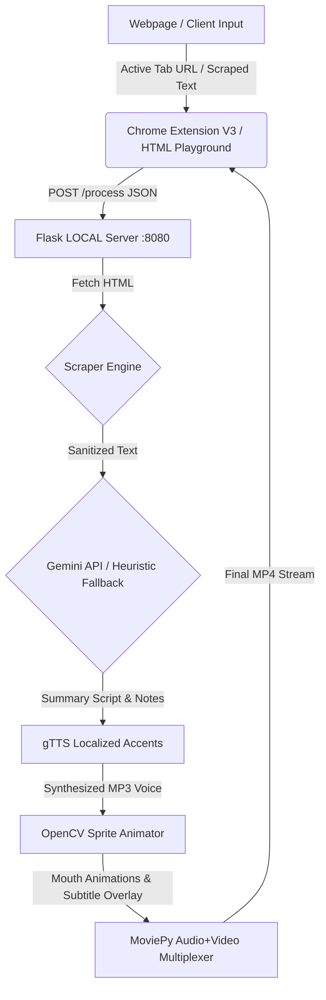

# 🎬 MP3by4 — Web-to-Video Sitcom Summarizer

A gorgeous, pastel-themed promotional platform and **Chrome Extension (Manifest V3)** that scrapes any webpage and converts it into a sitcom-style narrated video summary with lip-synced character animations and ready-made sticky notes.

> [!NOTE]
> **Developed with 💜 by Preetika P.**
> Converting dry webpage content into engaging, sitcom-style summaries read by your favorite sitcom stars!

---

## 🎨 Sitcom Narrator Cast

Our extension features three beloved sitcom stars, complete with custom-designed vector cartoon avatars, character-specific dialogue styles, and localized voice accents:

| Star | Sitcom Franchise | Style / Persona | Voice Profile |
| :--- | :--- | :--- | :--- |
| **👩 Rachel Green** | *Friends* | Gossipy, enthusiastic, and style-centered. | Standard US English Accent |
| **🤖 Sheldon Cooper** | *Big Bang Theory* | Ultra-logical, academic, and highly pedantic. | Formal British English Accent |
| **📺 Michael Scott** | *The Office* | Dramatic, highly energetic, and chaotic. | Energetic Canadian Accent |

---

## ✨ Core Features

* **🕸️ Server-Side Web Scraping:** Instantly fetches and sanitizes text content from any target URL to bypass client-side CORS blocks.
* **🧠 Sitcom-Persona AI Summarization:** Integrates with the Google Gemini API to write engaging scripts and structured bullet notes mimicking sitcom personalities.
* **🎙️ Localized TTS Voice Accent Engine:** Maps each narrator to a distinct regional Google Translation TTS voice endpoint to give Sheldon, Rachel, and Michael unique voice signatures.
* **📹 Audio-Reactive Lip-Synced Video Rendering:** A custom pipeline written in OpenCV and MoviePy that analyzes voice amplitudes to dynamically animate mouth open/closed states.
* **📺 Retro TV Showcase & Corkboard UI:** Web playground displays videos in a retro wooden television mockup and pins takeaway summaries on a digital corkboard sticky note container.
* **🔌 Compact Tabbed Chrome Extension:** Re-engineered for Manifest V3 compliance with dynamic event bindings, clean layout, and user-adjustable detail lengths (*Short & Sweet*, *Standard Brief*, *Detailed Notes*).
* **⚡ 100% Resilient Uptime Fallback:** Automatically switches into *Heuristic Fallback Mode* on API key limits, using local text parsing and injecting sitcom phrases directly.

---

## 🚀 Quick Start Guide

### Prerequisites
* **Python 3.8+** (Python 3.12 / 3.13 recommended)
* **Google Chrome** browser
* *Optional:* Google Gemini API Key (saves to `simple_working_server.py`)

### 1. Installation & Setup
Run the pre-made batch script on Windows to automatically configure the virtual environment and install dependencies:
```cmd
setup.bat
```

> [!TIP]
> If you prefer manual commands in Command Prompt:
> ```cmd
> python -m venv .venv
> call .venv\Scripts\activate.bat
> python -m pip install --upgrade pip
> pip install -r mp3by4/requirements.txt
> ```

### 2. Start the Server
Start the Flask backend server locally on port 8080:
```cmd
start_server.bat
```

> [!IMPORTANT]
> The server automatically detects if a default or placeholder API key is configured. If so, it boots into **Heuristic Fallback Mode** instantly, using local sentence parsers to generate localized sitcom scripts offline.

### 3. Load the Chrome Extension
1. Open Chrome and navigate to `chrome://extensions/`.
2. Toggle **Developer mode** in the top-right corner.
3. Click the **Load unpacked** button in the top-left corner.
4. Select the `extension/` directory inside this repository.

---

## 💻 Web Workspace Demo
Once your local server is running, open your browser and navigate to:
```text
http://127.0.0.1:8080/
```
Paste a URL or raw text in the workspace, select Rachel, Sheldon, or Michael, and click **Generate Summary** to see the system in action!

---

## 📁 Project Structure

```text
mp3by4/
├── extension/                     # Chrome Extension (Manifest V3)
│   ├── popup.html                # Redesigned compact pastel UI
│   ├── robust_popup.js           # dynamic event bindings & API requests
│   ├── background.js             # Service worker script
│   ├── manifest.json             # Extension permissions & assets
│   └── icons/                    # App icon files
│
├── mp3by4/                       # Python Backend Server
│   ├── assets/                   # Character image directories
│   │   ├── girl/                 # Rachel Green sprites (open/closed mouth)
│   │   ├── robot/                # Sheldon Cooper sprites
│   │   └── news_anchor/          # Michael Scott sprites
│   ├── static/                   # Output directory for video & audio streaming
│   │   └── index.html            # Premium glassmorphism landing page
│   ├── simple_working_server.py  # Flask server (CORS-ready, TTS accents, OpenCV renderer)
│   └── requirements.txt         # Project libraries (OpenCV, MoviePy, Flask, etc.)
│
├── start_server.bat             # Convenience server launcher
├── setup.bat                    # Dependency auto-setup script
└── README.md                    # This documentation file
```

---

## 🛠️ System Architecture



---

## 📝 License
This project is open-source and released under the **MIT License**.
All fictional characters, names, and quotes are used as parody/tribute references.
